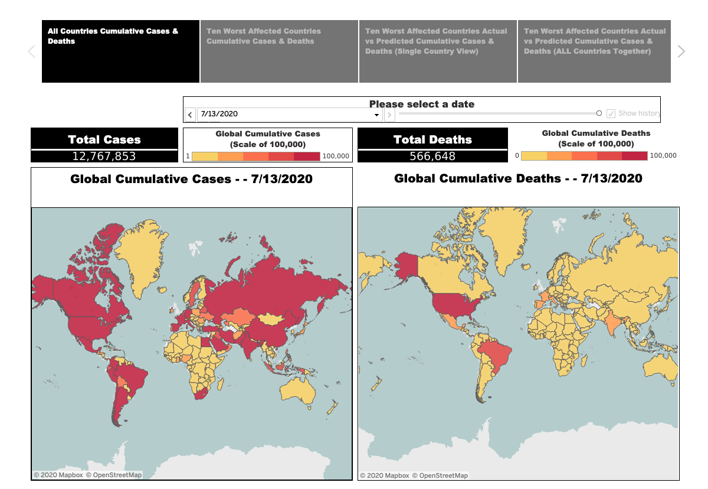

# PROJECT # 3
# The Final Push !!! 
## Team Members
* *Ann McNamara*
* *Swati Saxena*
* *Firdosh Patel*
 

(http://p3-env.eba-py98yrrw.us-east-1.elasticbeanstalk.com/)

### This repository contains the files regarding a Machine Learning and Visualization exercise conducted by our group. This folder contains the following:
1.	A Jupyter Notebook file called "Project3.ipynb" that was used to execute the SVM Machine Learning Model on our dataset.
2.	A CSV File called “WHO-COVID-19-global-data.csv” which contains the original data along with the predictions generated by the SVM Machine Learning Model. 
3.	A Tableau file called "Project_03_FP.twbx" that uses the COVID_FINAL.csv and creates visualizations to be displayed on our website.
4.	A Python file called "application.py" that creates Flask powered restful APIs and connects to the html file used for our website.
5.	A Folder called "templates" that contains a file called "index.html" which references the Tableau workbook and is used to create our webpage. 
6.	A file called "requirements.txt" which contains the requirements of the libraries / files that are needed for the application to run in AWS. 
7.	A zip folder called "Archive.zip" which contains the above files and folders, that was pushed to AWS. 
8.	A folder called "Images" that contains the images of our Tableau Workbook.

## Data Extraction:
This project is about a Machine Learning and Visualization exercise using Global COVID-19 data. 
 
 
As per wikipedia.org:
 
https://en.wikipedia.org/wiki/Coronavirus_disease_2019
 
Coronavirus disease 2019 (COVID-19) is an infectious disease caused by severe acute respiratory syndrome coronavirus 2 (SARS-CoV-2). It was first identified in December 2019 in Wuhan, China, and has resulted in a global pandemic. 
 
 
Our group undertook an exercise of analyzing and predicting Global COVID-19 data. 
 
We extracted data from the following sources for our analysis:
 
 
https://covid19.who.int/info
 
This data source has daily data related to the actual number of new daily cases, new daily deaths, cumulative cases and cumulative deaths for 216 countries in the world. 
 
 

## Data Transformation:
We did the following to transform the data:
1.	Applied the SVR Machine Learning Model. 
2.	Trained the Model on the existing data for the 10 worst affected countries. 
3.	Used the Model to Predict the new daily cases, the new daily deaths, the cumulative cases and the cumulative deaths for each of the 10 worst affected countries.
4.	Exported the original data along with the predicted data to a new CSV file. 
5.  We also trained the model on global data on  new daily cases, the new daily deaths, the cumulative cases and the cumulative deaths by date. 

## Data Load: 
We then loaded the CSV file into a Tableau workbook. This workbook can be found at the following location:
https://public.tableau.com/profile/firdosh.patel#!/vizhome/Project_03_FP/Story1 We created 9 worksheets, 4 dashboards, and one Story.
 
 

## Creation of a Python File with API routes:
We then used Flask to create API routes in a file called application.py. This file connects to the index.html file.
 

## Creation of an HTML file:
We then created an HTML file called index.html. This file contains the structure for the webpage. It also has an embedded link to connect to the Tableau workbook.
 

## Deploy to AWS:
We then zipped all the relevant files and folders and uploaded them to an environment on AWS using the service called "Elastic Beanstalk". This environment then provided us a URL for our webpage as follows:
 
http://p3-env.eba-py98yrrw.us-east-1.elasticbeanstalk.com/

# Conclusions:
1.	
2.	
3.	
4.	
5.	

## Key Takeaways:

# References/Data Sources
Map created with tableau public and data from here https://covid19.who.int/WHO-COVID-19-global-data.csv

Machine Learning Models (in Jupyter Notebook) created by following this tutorial https://www.youtube.com/watch?v=sHWKN5dakPw
