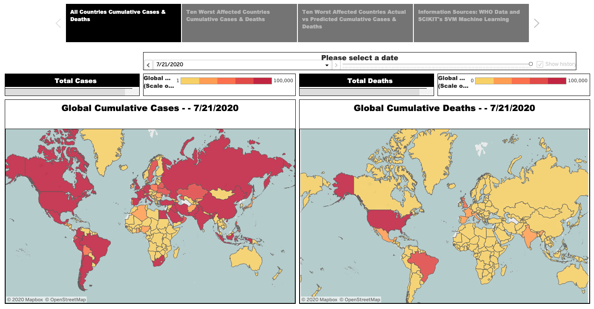
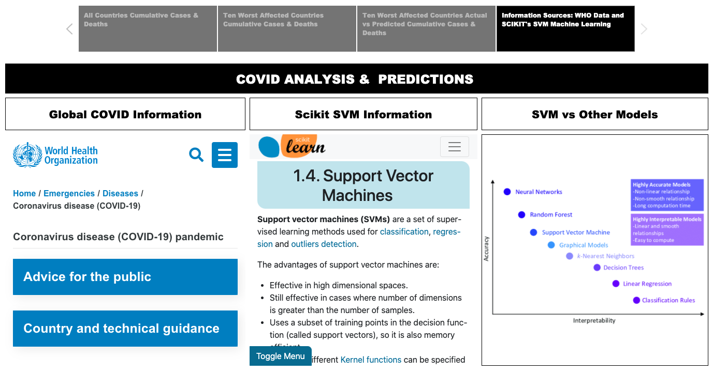

# PROJECT # 3
# The Final Push !!! 
## Team Members
* *Ann McNamara*
* *Swati Saxena*
* *Firdosh Patel*
 

(http://p3-env.eba-py98yrrw.us-east-1.elasticbeanstalk.com/)

### This repository contains the files regarding a Machine Learning and Visualization exercise conducted by our group. This folder contains the following:
1.	A folder called "Images" that contains the images of our Tableau Workbook.
2.	A folder called “Notebooks” that contain the Jupyter Notebook files that were used to execute the SVM Machine Learning Model on our dataset.
3.	A folder called “Prediction Data” that contains the outputs from executing the SVM Machine Learning Model on our dataset.
4.	A Folder called "templates" that contains a file called "index.html" which references the Tableau workbook and is used to create our webpage. 
5.	A Tableau file called "Project_03_FP.twbx" that uses the COVID_FINAL.csv and creates visualizations to be displayed on our website.
6.	A Python file called "application.py" that creates Flask powered restful APIs and connects to the html file used for our website.
7.	A file called "requirements.txt" which contains the requirements of the libraries / files that are needed for the application to run in AWS. 
8.	A CSV File called “COVID_FINAL.csv” which contains the original data along with the predictions generated by the SVM Machine Learning Model. 

## Data Extraction:
This project is about a Machine Learning and Visualization exercise using Global COVID-19 data. 
 
 
As per wikipedia.org:
 
https://en.wikipedia.org/wiki/Coronavirus_disease_2019
 
Coronavirus disease 2019 (COVID-19) is an infectious disease caused by severe acute respiratory syndrome coronavirus 2 (SARS-CoV-2). It was first identified in December 2019 in Wuhan, China, and has resulted in a global pandemic. 
 
 
Our group undertook an exercise of analyzing and predicting Global COVID-19 data. 
 
We extracted data from the following sources for our analysis:
 
 
https://covid19.who.int/info
 
This data source has daily data related to the actual number of new daily cases, new daily deaths, cumulative cases and cumulative deaths for 216 countries in the world. 
 
 

## Data Transformation:
We did the following to transform the data:
1.	Applied the SVR Machine Learning Model for regression to predict future trends.
2.	Trained the Model on the existing data for the 10 worst affected countries. 
3.	Used the Model to Predict the new daily cases, the new daily deaths, the cumulative cases and the cumulative deaths for each of the 10 worst affected countries.
4.	Exported the original data along with the predicted data to a new CSV file. 

A table of the accuracy scores can be seen below.   As expected the model trained more accurately on some datasets than others. 

## Data Load: 
We then loaded the CSV file into a Tableau workbook. This workbook can be found at the following location:
https://public.tableau.com/profile/firdosh.patel#!/vizhome/Project_03_FP/Story1 We created 11 worksheets, 4 dashboards, and one Story.

The Story contains 4 captions representing the 4 dashboards as follows:

1.	Caption # 1 depicts Actual Data for all 216 countries using 2 Geographical Maps - - one for the Global Cumulative Cases by Country, and the other for the Global Cumulative Deaths by Country. There is a date slider that the user can use to view these maps for any date within the dataset.

2.	Caption # 2 depicts the Actual Data for the 10 worst affected countries using 2 Geographical maps - one based on the Cumulative Cases by Country, and the other based on the Cumulative Deaths by Country. There is also a “Tree Map” between these 2 Geographical maps. The Tree Map depicts two dimensions, the cases and the deaths.  The data for the 10 worst affected countries are shown using rectangle sizes and colors. The Rectangle size represents the scale of the cumulative cases (the larger the rectangle size, the larger the number of the Cumulative Cases and vice versa). The Rectangle colors represent the scale of the Cumulative Deaths on a scale ranging from yellow to amber/orange  to red (the closer the color to red, the larger the number of the Cumulative Deaths, whereas the closer the color to yellow, the smaller the number of the Cumulative Deaths). There is a date slider that the user can use to view these 3 maps for any date within the dataset.

3.	Caption # 3 depicts the Actual Data vs the Predicted Data for the 10 worst affected countries using 2 Charts - - one for Cumulative Cases by Country and the other for Cumulative Deaths by Country for the entire date range within the Dataset. The predictions were made for the entire date range of the actual data PLUS a period of one month beyond the last date with Actual Data. There is a dropdown box which allows the user to select any of the 10 worst affected countries. There is a second dropdown box which allows the user to specify the range of the predicted data. There are 4 choices available to the user – 1 Week, 2 Weeks, 3 Weeks, and 4 Weeks beyond the date range of the actual data. 

4.	Caption # 4 contains 3 sections. The left section contains a link to the World Health Organization website from which we sourced the data. The middle section contains a link to the SKLearn website from which we got the SVM (Support Vector Machine) Machine Learning library that we used to predict the data. The right section contains a link to a webpage that shows how the SVM Machine Learning Library compares to other prominent Machine Learning Libraries on a chart that measures Accuracy vs Interpretability.  
 
 

## Creation of a Python File with API routes:
We then used Flask to create API routes in a file called application.py. This file connects to the index.html file.
 

## Creation of an HTML file:
We then created an HTML file called index.html. This file contains the structure for the webpage. It also has an embedded link to connect to the Tableau workbook.
 

## Deploy to AWS:
We then zipped all the relevant files and folders and uploaded them to an environment on AWS using the service called "Elastic Beanstalk". This environment then provided us a URL for our webpage as follows:
 
http://p3-env.eba-py98yrrw.us-east-1.elasticbeanstalk.com/

# Conclusions:
1.	
2.	
3.	
4.	
5.	

## Key Takeaways:

# References/Data Sources
Map created with tableau public and data from here https://covid19.who.int/WHO-COVID-19-global-data.csv

Machine Learning Models (in Jupyter Notebook) created by following this tutorial https://www.youtube.com/watch?v=sHWKN5dakPw
